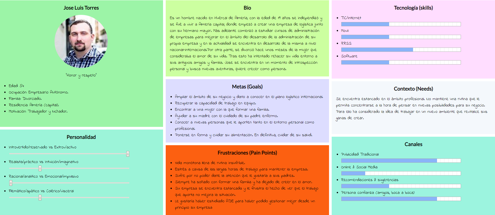
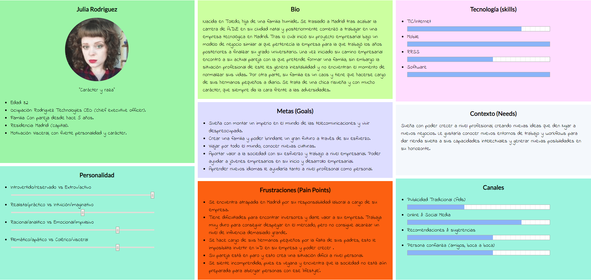
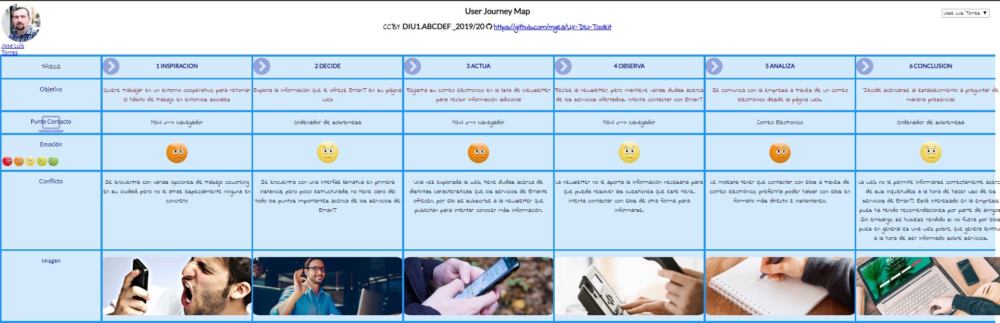
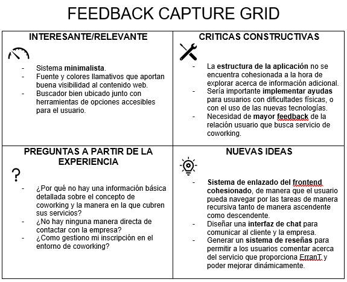

# Web Redesign Coworking Environment

Trabajo Final DIU 2019-20 (Rediseño de la web de una empresa de coworking)

Descripción: aplicación de las técnicas y metodologías de diseño centrado en usuario y UX a un caso real: el (re)diseño de la web para unas empresas de coworking. Partimos desde un diseño web existente de coworking. La web de coworking escogida para este rediseño será la asociada a una empresa de coworking granadina llamada ErranT.

Autor
 * :bust_in_silhouette:   Miguel Ángel Campos Cubillas   :octocat:

---

#### Introducción

La empresa ErranT propone aportar una solución al entorno coworking en el ámbito granadino. Para ello provee a la ciudad de un espacio de trabajo compartido apra profesionales autónomos, teletrabajadores y empresarios que requieren de un espacio de trabajo adecuado a sus necesidades.

Esta propuesta, se basa en la idea de mantener un workflow amigable en un entorno de trabajo compartido entre especialistas en diferentes áreas de conocimiento/trabajo para nutrirse mutuamente tanto en el ámbito intelectual como social. Por ello, la figura del cliente es la base de la pirámide de este modelo de negocio, su bienestar lo es todo. Generar un buen entorno de trabajo es esencial, al mismo tiempo de dar visibilidad a este.

#### Objetivos de ErranT

Principalmente ErranT como hemos comentado, pretende generar un entorno socio/intelectual viable para el trabajo compartido entre profesionales de áreas diversas, de manera que estos se nutran de manera intercambiable. Algunos objetivos generales a tener en cuenta desde mi punto de vista para generar una web acorde al modelo de negocio son:

- Estudiar el nicho de negocio del entorno del sector del coworking de manera genérica para conocer los puntos fuertes de los competidores, tomarlos en cuenta y mejorar sus puntos débiles para sobrepasarles en esos aspectos y ser diferenciales. Para ello considero importante realizar un buen analisis de competencia que desemboque en un UX Desk Research & Analisis.

- Generar un diseño web limpio y eficiente que informe de manera eficiente y resumida los servicios que la empresa de coworking ofrece. Aparte de esto, dotarla de funcionalidad, para que aun siendo minimalista permita al usuario optar a funcionalides adecuadas para contactar con la empresa de manera telemática cómodamente.

- Mantener un esquema adecuado al entorno de usuarios que harán uso de la web.

#### Estudio del Contexto

Principalmente, los usuarios que utilizan esta clase de servicios, si navegasen por webs en busca de información acerca de empresas que provean de entornos coworking buscarían informarse de manera instantanea acerca de los puntos clave que le interesan acerca de los servicios que estos ofrecen. Aparte, tener disponible un contacto directo con la empresa a través de la plataforma web.

Los puntos clave de manera genérica son:

- Información detallada, explícita y bien ordenada (sin demasiada extensión).

- Estructura web bien definida, minimalista y funcional.

- Entorno web agradable para la vista; con fuentes, iconos y colores vistosos que generen contraste.

- Navegabilidad sencilla y rápida por menús de contexto.

- Contacto directo con la empresa asociada a la web para cualquier tipo de consulta e información extra.

#### UX Desk Research & Analisis

#### Competitive Analysis

De manera genérica, las webs relacionadas con empresas que ofrecen servicios coworking, basan su estilo y estructura en torno a la captación de nuevos clientes mediante unos diseños atractivos para la vista. Además de esto, buscan informar al usuario, de manera amena y somera acerca de los servicios que la empresa propone al cliente, de manera que este tenga acceso a contenido extendido de manera ordenada en caso de interesarse. 

Por otra parte, suelen tratar de generar un sistema de comunicación con el cliente para mantenerle informado de novedades. En este caso, de manera general, proveen al usuario de una subscripción opcional a sus newsletters y distitos sistemas de difusión de noticias e información adicional. 

En el caso concreto del contexto de ErranT, esta empresa cumple algunos de estos aspectos generales. Sin embargo, su estructura es pobre y denota falta de trabajo a la hora de cuidar errores en su navegabilidad. Frente a otras webs de su entorno de trabajo, queda artrás en el aspecto visual e informativo. A modo personal, si me considerase usuario interesado de este tipo de servicio, no presentaría un interés demasiado elevado por la propuesta empresarial de ErranT. Por otra parte, proponen un sistema de contacto con el cliente poco cuidado y frio, como muchos de sus competidores.

#### Personas

A la hora de analizar la web, he considerado la posibildad de generar dos personas con perfiles que podrían mantener interes a la hora de utilizar los servicios que presenta ErranT. Durante el proceso de creación de las personas, he tomado la decisión de crear dos perfiles humanos divergentes en diferentes aspectos personales, para poder analizar experiencias de usuario desafiantes para el sistema. Esta decisión dará pie a explorar ramas del sistema de manera más profunda.

Este punto considero que es clave para poder examinar de manera certera partes del sistema de manera que este se ponga en diferentes aprietos a la hora de adaptarse a la calidad de diseño que requieren estas personas ficticias.

###### JOSE LUÍS TORRES

###### JULIA RODRIGUEZ

#### User Journey Map

Para el análisis de experiencias de usuario acerca del sistema web que presenta la empresa ErranT, he desarrollado un solo journey map enfocado en la experiencia propia de Jose Luís Torres, mi primera persona ficticia. He considerado un solo punto de vista, puesto que con una simple experiencia de usuario he determinado los principales errores del diseño web que presenta la plataforma.

El escenario escogido en el User Journey Map es fiel a las características de Jose Luís, sin embargo cumple con la experiencia de usuario media que podría tener cualquier usuario interesado en contratar los servicios ofertados por la empresa ErranT, o cualquiera de sus competidores.

El "mood" del particicpante, determina la situación del sistema en el entorno y escenario cotidiano en el que se desarrolla la empresa granadina de coworking.

###### EXPERIENCIA DE USUARIO 1 (JOSE LUÍS TORRES)

###### Usability Review

A la hora de tener en cuenta la capacidad de usabilidad que tiene el sistema web que ErranT presetnta hacemos uso del método estructurado "Usability Review", el cuál evalua el sistema en función de los principios de usabilidad y buena praxis del mismo.

Es una manera de poner a prueba de manera teórica el sistema tras haberle sometido a pruebas empíricas con otras metodologías. Esto permite generar una aproximación de los putnos débiles del diseño y encontrar partes a perfeccionar.

[[Documento de revisión de usabilidad]](UsabilityReview/Usability-review.pdf)

#### Valoración final (numérica):
>>> - 76

Según la valoración de la usabilidad podemos determinar que estamos ante un sistema que cumple con las características principales que debería ofrecer. Sin embargo tiene puntos esenciales a mejorar. Principalmente, el sistema debería mostrar una organización mucho más estructurada.

#### UX Design

#### FeedBack Capture Grid

En este punto del sistema, tras la etapa de investigación y análisis del sistema, entra en juego el "Feedback Capture Grid". Este método es una manera estructurada de organizar el "feedback" que recogemos de la fase de investigación y análisis del sistema.

Es una forma de capturar el feedback en la etapa de diseño y en etapas posteriores en función de la experiencia de los usuarios.

#### Propuesta de Valor 

La propuesta que propongo para el proyecto de reestructuración es crear un entorno minimalista y conciso con gran adaptabilidad tanto para nuevos usuarios como experimentados que se encuentren interesados en lo servicios de coworking que ErranT ofrece. 

De manera general, la estructura de la información en la web debe de ser reestructurada desde el sistema de frontend hasta el backend del mismo. Esto mejoraría la vista y cohesión de los datos que presenta la web y facilitaría la comprensión de los servicios que nos brinda ErranT. Una vez estructurada la web, la navegabilidad que el usuario generaría sería fantástica, resolviendo problemas estructurales clave.

Por otra parte, sería interesante detallar la información abreviada en las páginas principales de la web en forma de anexos a partes del la web organizadas en forma de árbol descendente, que organicen la información de tal forma que sea facil determinar el estado de navegación que estamos sufriendo. Esto resulta clave a la hora de hacer ameno el uso de la web y de recoger información.

En cuanto al contacto con la empresa de manera directa, surgen varios problemas. Estos se deben a que la única manera de comunicarnos con la empresa radica a través del correo-e o en su defecto mantenernos informados por una newsletter periódica. Por ello, es necesario desarrollar e implementar un sistema de chat a tiempo real, de tal manera que el cliente tenga disponible la herramienta perfecta para transmitir sus inquietudes a la empresa y mantenerse fielmente informada, recibiendo el suficiente feedback por parte de ErranT.

Finalmente, un sistema de reseñas ayudaría a tomar decisiones por parte de usuarios a la hora de tomar acción en embarcarse en nuevos proyectos en entornos de coworking como ErranT. Por otra parte, sería una manera de recibir feedback por parte de los clientes finales de ErranT.

#### Conclusión sobre el rediseño

A modo de conclusión sobre el rediseño del sistema web que nos aporta ErranT, cabe destacar el minimalismo y las buenas herramientas que este aporta a disposición de las funcionalidades de los usuarios. Sin embargo, este sistema web mejoraría ampliamente con la inclusión de conceptos como la estructuración web, navegabilidad de la misma, distribución inteligente de la información y métodos de comunicación cliente-empresa.